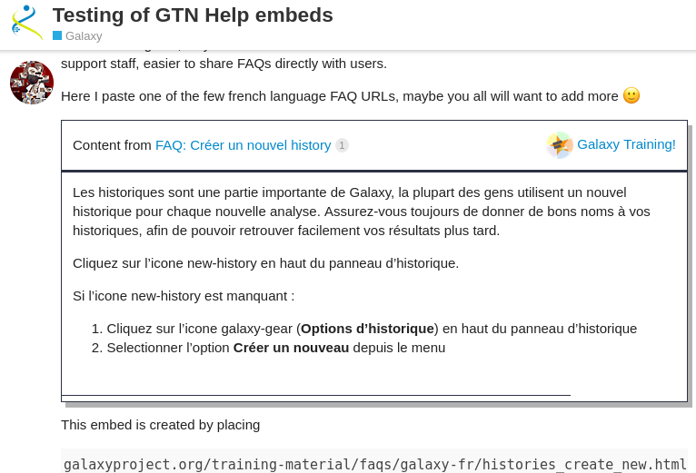

# Galaxy OEmbed Server

> oEmbed is a format for allowing an embedded representation of a URL on third party sites. The simple API allows a website to display embedded content (such as photos or videos) when a user posts a link to that resource, without having to parse the resource directly.

This server processes selected pages for embedding within Discourse (and other sites) via exposing an [OEmbed](https://oembed.com/) endpoint.

When you post a supported URL in e.g. Discourse, then the contents of that URL can be rendered in a nicer format that's more useful for end users.

## Supported URLs

- `https://training.galaxyproject.org/training-material/faqs/**/*.html`
- Something else here? File an issue!

## LICENSE

AGPL-3.0-or-later
